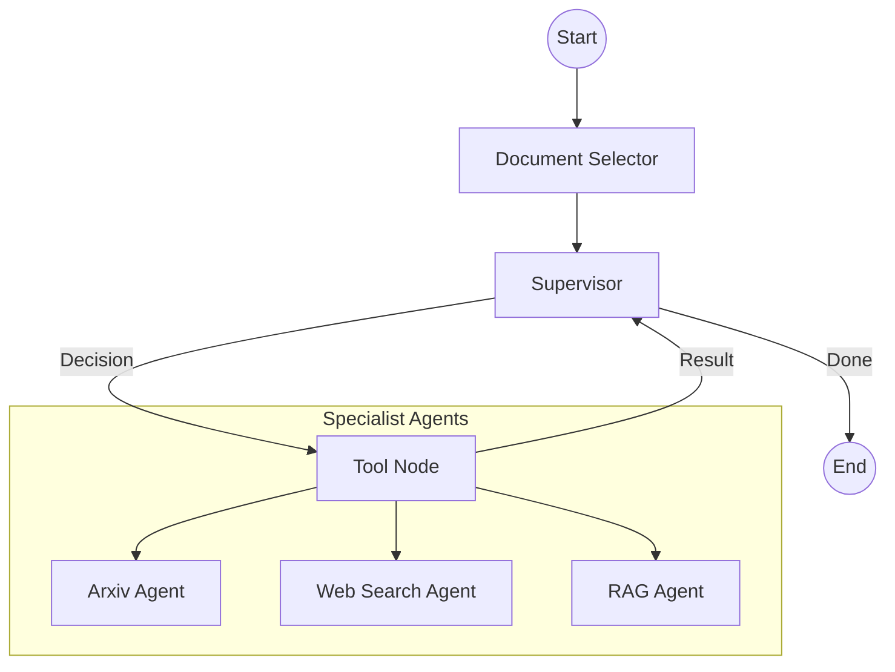

# Multi-Agent Research System 🚀

A powerful multi-agent system built with **LangGraph**, **Google Gemini**, and **Pinecone** for advanced document research and retrieval. This system orchestrates specialized agents to search scientific papers (Arxiv), perform general web research (Tavily), and query internal knowledge bases (RAG).

## ✨ Key Features

- **Supervisor Orchestration**: A central supervisor agent intelligently routes queries to the most relevant specialist.
- **Specialized Research Agents**:
    - **Arxiv Agent**: Searches for scientific and academic papers.
    - **Web Search Agent**: Uses Tavily for real-time web information.
    - **RAG Agent**: Queries your internal documents stored in Pinecone using metadata filtering.
- **Stateful Memory**: Built on LangGraph to maintain context and iterative research steps.
- **Modern LLM Support**: Powered by Google Gemini (e.g., `gemini-2.5-flash`).

## 🛠️ Architecture

The system follows a supervisor-specialist pattern. The supervisor analyzes the user query and decides which tool (agent) to invoke. Responses from specialists are fed back to the supervisor for final synthesis or further investigation.



## 🚀 Getting Started

### 1. Prerequisites
- Python 3.9+
- [Pinecone](https://www.pinecone.io/) account and API key.
- [Google AI Studio](https://aistudio.google.com/) API key for Gemini.
- [Tavily](https://tavily.com/) API key for web search.

### 2. Installation
Clone the repository and install dependencies:
```bash
pip install -r multiagent/requirements.txt
```

### 3. Configuration
Create a `.env` file in the `multiagent/` directory:
```env
GEMINI_API_KEY=your_gemini_key
PINECONE_API_KEY=your_pinecone_key
PINECONE_INDEX_NAME=research-agent-index
TAVILY_API_KEY=your_tavily_key
```

### 4. Ingesting Documents (RAG)
Place your PDF documents in the `multiagent/` directory and run the ingestion script to index them in Pinecone:
```bash
python multiagent/rag/ingest.py
```

### 5. Running the Agent
Start the research system and enter your query:
```bash
python multiagent/main.py
```

## 📁 Project Structure

- `multiagent/main.py`: Interactive entry point for the research agent.
- `multiagent/graph.py`: LangGraph workflow and orchestration logic.
- `multiagent/agents.py`: LLM configuration and tool definitions (Arxiv, Tavily, RAG).
- `multiagent/rag/ingest.py`: Script for processing PDFs and upserting vectors to Pinecone.
- `multiagent/requirements.txt`: Project dependencies.

## 🤝 Contributing
Feel free to fork this project and submit pull requests for any improvements or new features!


