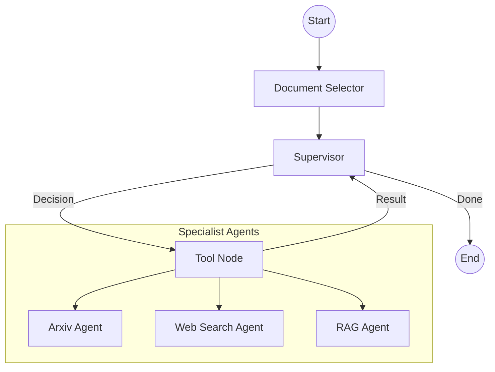

# Multi-Agent Research System Walkthrough

I have implemented a multi-agent research system using Pinecone, Langgraph, and Gemini. The system orchestrates three specialized agents to perform research: Arxiv Agent, Web Search Agent (Tavily), and RAG Agent.

## System Architecture

The system uses a **Supervisor** pattern where a central node decides which specialist to call based on the user's query.

## Key Files

- [agents.py](file:///d:/Project/llm_chatbot/multiagent/agents.py): Defines the specialist tools and LLM configuration.
- [graph.py](file:///d:/Project/llm_chatbot/multiagent/graph.py): Implements the Langgraph state machine and orchestration logic.
- [main.py](file:///d:/Project/llm_chatbot/multiagent/main.py): Entry point for running the research agent.

## How it Works

1. **Document Selection (Metadata Filtering)**: The system first lists documents already present in your Pinecone index (from Part 1). You can select which ones to focus on, which the system then uses as a **metadata filter** (e.g., `filename == 'doc1.pdf'`) for the RAG agent.
2. **Supervisor Orchestration**: The Supervisor analyzes the query and determines if it needs to search Arxiv, the Web, or the internal Pinecone index.
3. **Tool Execution (Pre-indexed RAG)**: The RAG agent queries your **existing** Pinecone index. It does not create the index in real-time.

## Verification

### 1. Requirements Check
- [x] **Pinecone Integration**: Skeleton for RAG search implemented in `agents.py`.
- [x] **Langgraph Multi-Agent**: Graph structure established in `graph.py`.
- [x] **Document Selection**: Interactive node in the graph to restrict scope.
- [x] **Arxiv Agent**: Functional tool using `ArxivAPIWrapper`.
- [x] **Web Search Agent**: Functional tool using `TavilySearchResults`.
- [x] **RAG Agent**: Tool implemented with metadata filtering support.

### 2. Sample Flow
When running `python multiagent/main.py`, the flow looks like this:
1. `Document Selector` offers "document_1.pdf", "research_notes.txt", etc.
2. User selects documents or provides a query.
3. `Supervisor` calls `arxiv_search` if the query is academic.
4. `Supervisor` calls `web_search` for current events or broader context.
5. `Supervisor` calls `rag_search` for internal knowledge.
6. The final answer is synthesized and presented to the user.
